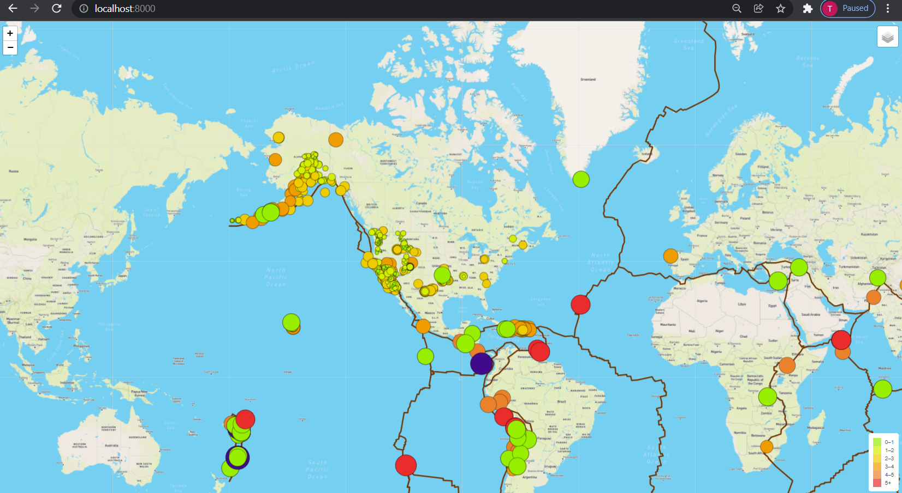
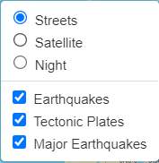
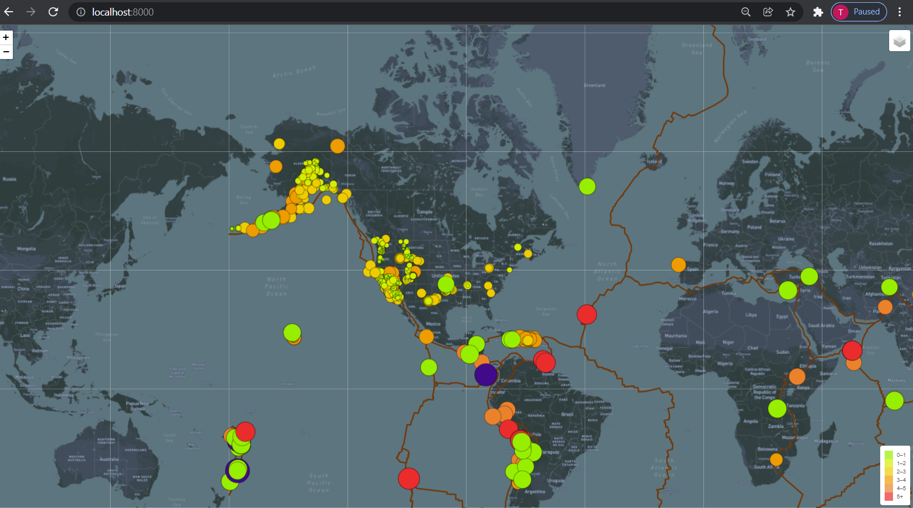
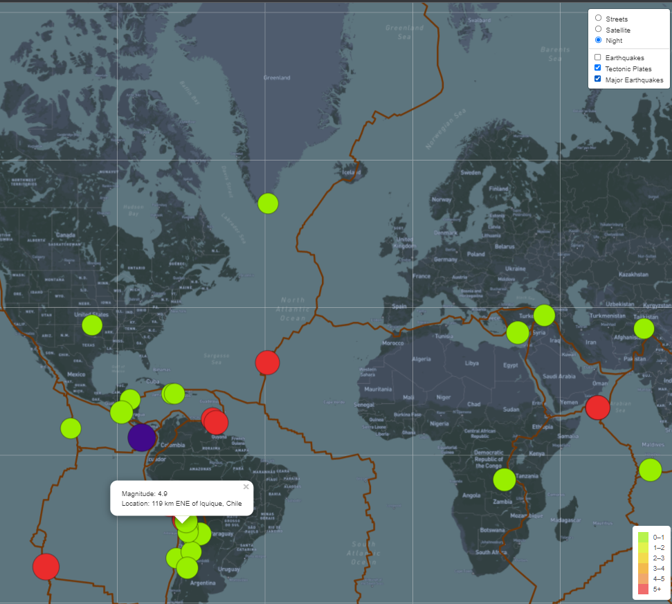

# Mapping Earthquake and Tectonic Plates

## Overview
The purpose of this project is to use USGS data and MapBox mapping tools to create a dynamic, interactive map of the world's most recent earthquake events, and visually show the tectonic plates in relation to earthquake activity.

## Expectations
The challenge requires the following deliverables:
- Add a tectonic plate layer to the earthquake map
- Add major earthquakes as a layer to the data
- Add an additional map - two are already built: street and sattelite; required to add one more

## Results
The first requirement is all necessary files and folders are loaded to Github. That folder is available above or at this link:

<a href="https://github.com/TeresaWehmeier/Mapping_Earthquakes/tree/main/Earthquakes_Challenge">Earthquake Challenge Folder</a>

The next requirement is that all layers and visuals appear when the site is opened. Here is a shot of the page when opened:

There should also be three base layers, including the two developed prior to the challenge. The third created is labeled "Night" in the layers section of the map. 

- The night map is presented here:

A third is to add a major earthquake layer to the map and popup markers appear on all layers, as seen in above layers image and on the full screenshot here:

## Summary
There were a few issues I found when reviewing the map that need attention, but I did not have time during the week this challenge was developed to further enhance them. However, the few items that should be fixed are:
- The legend is relevant to the "eartquake" layer only, and does not apply to the "major earthquake" layer. There should be a separate legend for the two layers. However, since they can both appear simultaneously, I felt that would cause too much content on the map, and make it even more confusing. However, I may go in and modify the legend to include the additional layer for earthquakes with a magnitude greater than 6.
- When one of the layers (earthquakes and major EQ) are turned off then on, the other layer may disappear. Probably a bug in my code that I need to investigate.
- I would probably change the tectonic plate layer to always display. I don't really see the need to turn it off and on. 

